Link to [notebook](./0_decomposition.ipynb)

## Intro:

This would be a step-by-step breakdown of each of the "phases" of exploration that were pursued with the goal of satisfying the desirata of the project --- an "interpretable" visualization of "features" that make sense, in terms of their importance in helping the model classify digits properly.

## Step - 1: Estimating the similairity and completeness of class-specific eigenvectors.

Taking a step back, the aim of this phase was to two important pieces of information, from the original B - interaction tensor.
- Finding the effective rank of the matrix using simple eigen-spectrum based method --- the ratio between the cummulative sum of top eigenvalues divided by all of them (all considered in absolute value)

$$F_c(k) \;=\; \frac{\sum_{j=1}^{k} |\lambda_{(j)}^{(c)}|}{\sum_{j=1}^{P} |\lambda_{(j)}^{(c)}|}, \qquad |\lambda_{(1)}^{(c)}| \geq |\lambda_{(2)}^{(c)}| \geq \cdots, \quad P = 784.$$

- Calculating the similarity between top-2 eigenvectors of each slice of B
    - The measure of similarity chosen was just cosine similarity, $\cos(u_j^{(c)}, u_{j'}^{(c')}) = \langle u_j^{(c)}, u_{j'}^{(c')}\rangle$ since both eigenvectors are unit-norm.

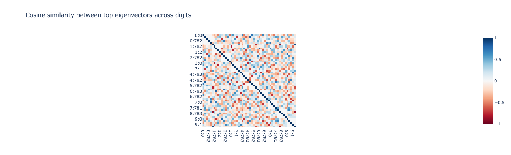

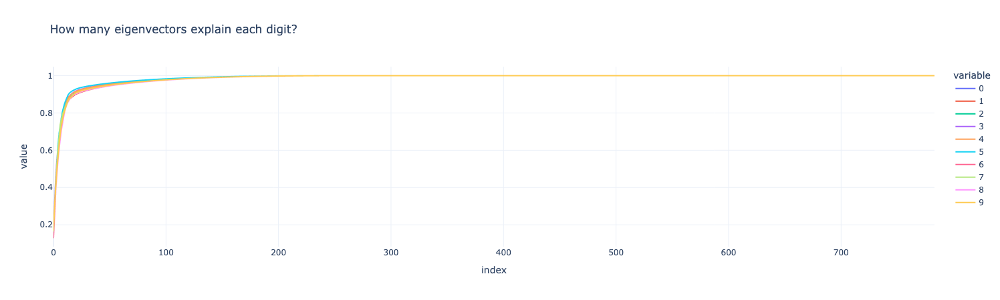

### Observations:
- Clearly, as expected, the 784x784 $B_i$ matrix is representable almost entirely in just a few ranks.
- The cosine similarity graphs don't really reveal anything informative, there's no clear pattern of similarity between cross-class eigenvectors in this graph.

## Step - 2: Cross-class eigen completeness.

A mental model for a better way to figure out how much cross-class feature sharing occurs, this was approach was taken:
- Given a target-class-matrix and top-k eigenvectors from a source-class-matrix, how much of the target-class-matrix could be approximated with these eigenvectors.
- This is operationalized by first projecting the target-class-matrix into the subspace occupied by the top-k eigenvectors from the source-matrix andt then taking the ratio of the fronieus norm between the approximated and real matrix.

Concretely, with $U_s = [u_1^{(s)}, \ldots, u_k^{(s)}] \in \mathbb{R}^{P \times k}$ the top-$k$ eigenvectors of source class $s$,

$$\hat{B}_t^{(s)} \;=\; U_s U_s^\top\, B_t\, U_s U_s^\top, \qquad C(t, s;\, k) \;=\; \frac{\big\|\hat{B}_t^{(s)}\big\|_F^{\,2}}{\|B_t\|_F^{\,2}}.$$

|  |  |
|---|---|
| 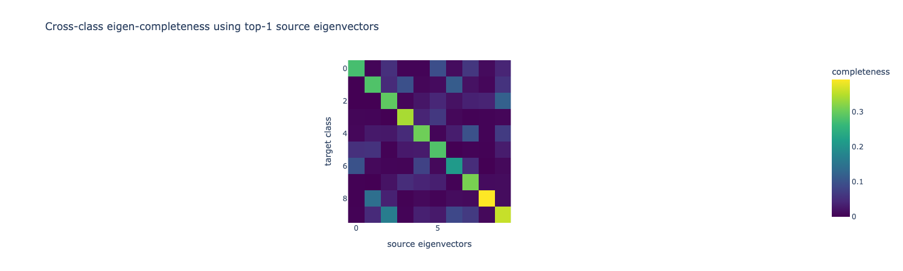 | 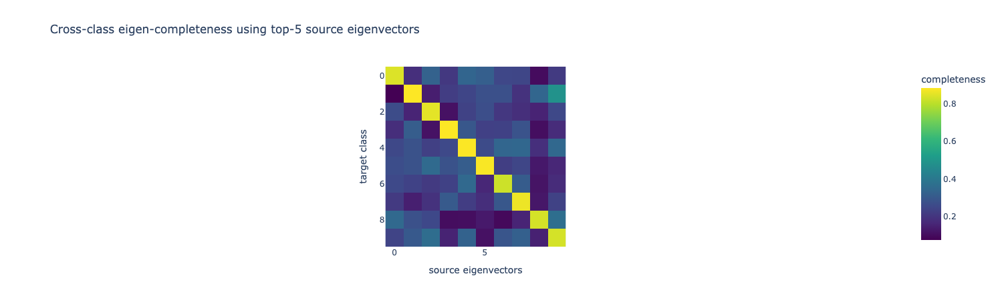 |
| **(a) k=1** | **(b) k=5** |
| 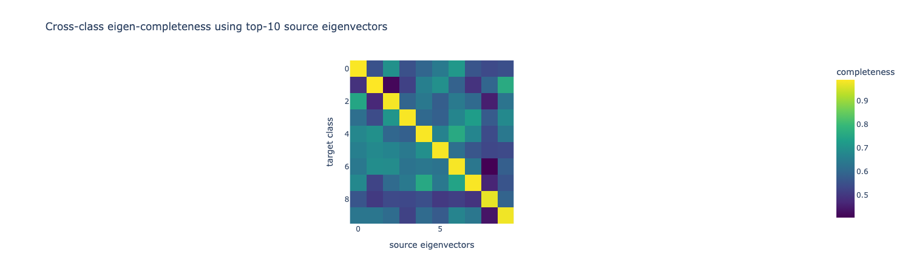 | 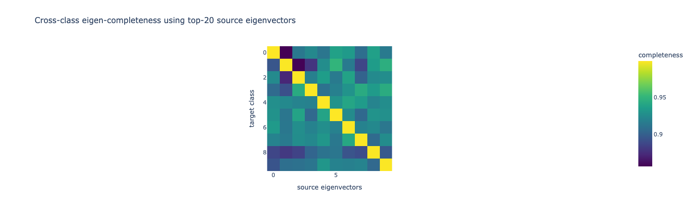 |
| **(c) k=10** | **(d) k=20** |
|

### Mean completeness

- The per-class is divided by $C$ while the cross-class is divided by $C * (C-1)$ --- so variance might be an issue here.

$$\bar{C}_{\text{within}}(k) = \tfrac{1}{C}\sum_{c} C(c,c;k), \qquad \bar{C}_{\text{cross}}(k) = \tfrac{1}{C(C-1)}\sum_{t \neq s} C(t,s;k).$$

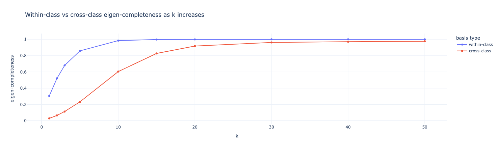

### Observations:
- As expected as per the previous step, the within-class or per-class completeness saturates by 10 eigenvectors.
- Unexpectedly, much of the individual matrix of any source digit could also be approximated by the subspace of another target's eigenvectors --- within k=10 and k=20 eigenvectors. --- this reveals that the classification digits share a lot of "features" between them or at the very least even if few of the eigenvectors pack a lot of individual features within them, few eigenvectors could probably represent the entire 3-D tensor --- this result motivated the next two steps in finding a decomposition that may work given this prior information.

## Step-3: Diagonal Hypothesis

In this step, we first take a class-summed energy matrix --- summing $B_c*B_c^\top$ for each $c$.

$$G \;=\; \sum_{c=0}^{C-1} B_c B_c^\top \;\in\; \mathbb{R}^{P \times P}.$$

Then, we take the top-R eigenvectors of this matrix and assume this is our shared basis $V \in \mathbb{R}^{P \times R}$.

The first hypothesis, termed as the diagonal hypothesis states that each $B_c$ is approximable by the linear combination of class-specific scalars over the set of these eigenvectors:

$$B_c \;\approx\; \sum_{r=1}^{R} a_{c,r}\, v_r v_r^\top, \qquad a_{c,r} = v_r^\top B_c v_r.$$

To test that, we plot the same completeness graphs by taking the ratio of the same approximation's froenius norm by the the actual norm.

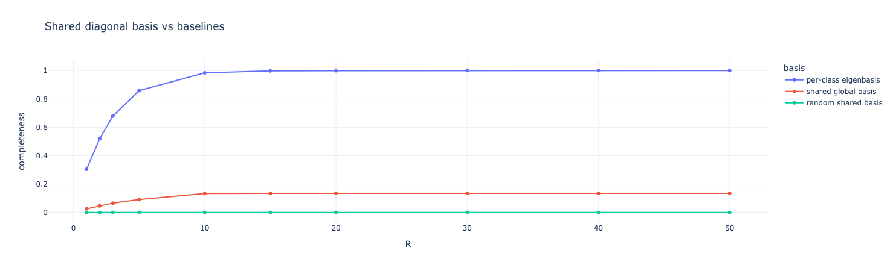

### Observations:
- The hypothesis does not seem to hold true, as the eigenvectors of the shared global basis, don't seem to capture the entirety of the original matrices and have a clear hard cap.

## Step-4: Feature-interaction hypothesis

Considering the results from Step-2 and Step-3, it is rational to assume that while each class may use a shared basis, they are not just merely selecting scalars over the visual ingredients (the eigenvectors of the shared basis) --- rather, a better way to represent each slice would be a tucker-2 decomposition where we have -

$$B_c \;\approx\; V M_c V^\top, \qquad M_c = V^\top B_c V \;\in\; \mathbb{R}^{R \times R}.$$

The same mean completeness graph is present here -

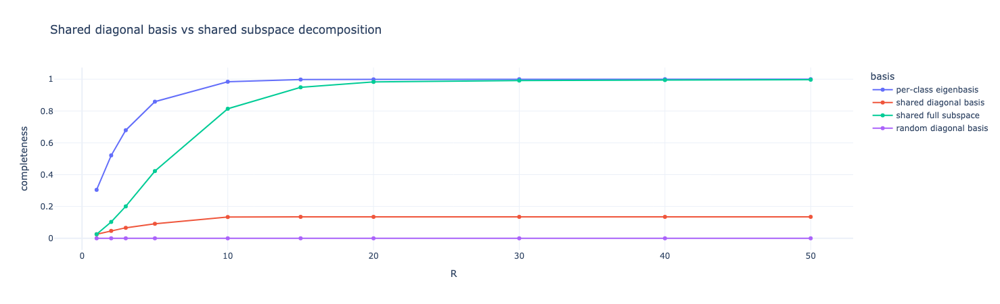

### Observations:
- The takeaway is clear, when R is between 20 and 30, sharing V is enough to compress the input representation --- but the classes don't just re-weight shared "features" of this global basis, they make these features "interact" between themselves in a **class-specific** way instead.
    - To note, we use "features" here to mean the eigenfeatures of the shared global basis --- which may themselves also be superposed lumps of actual features.

## Step-5: Core-Energy and Pairing Components.

First, we quantify the differential energies of off-diagonal (cross-feature) and on-diagonal (inter-feature) for each class.

$$E_c^{\text{diag}} \;=\; \sum_{r=1}^{R} M_c[r,r]^{\,2}, \qquad E_c^{\text{off}} \;=\; \|M_c\|_F^{\,2} - E_c^{\text{diag}}.$$

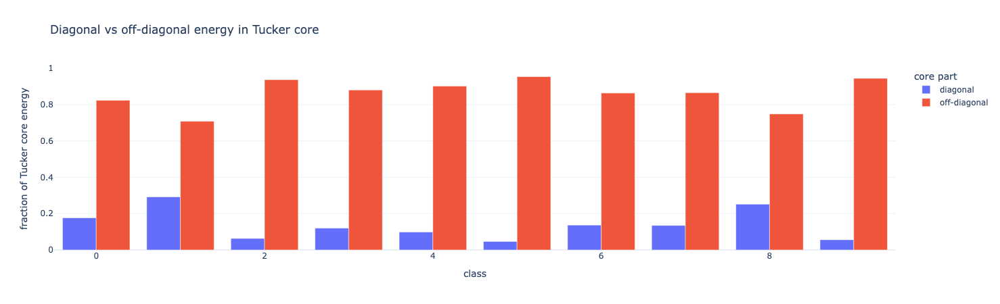

It's clear to see why step-3 and the diagonal model fails --- it gets rid of the main components of the $M_c$ which is the actual interaction matrix for each class between features.

Then, Inspired by the methods used in the preview of the exercise, we can interpret the contribution of each feature interaction to a given class' attribution by using the identity of $a b$ as expression of the difference in squares between $a+b$ and $a-b$:

$$ab \;=\; \tfrac{1}{4}(a+b)^2 \;-\; \tfrac{1}{4}(a-b)^2 \quad\Longrightarrow\quad (v_r^\top x)(v_s^\top x) \;=\; \tfrac{1}{4}\big((v_r+v_s)^\top x\big)^2 \;-\; \tfrac{1}{4}\big((v_r-v_s)^\top x\big)^2,$$

with each off-diagonal pair $(r,s)$ contributing a rank-2 update $\Delta B_c^{(r,s)} = M_c[r,s]\,(v_r v_s^\top + v_s v_r^\top)$ and class-loading vector $2\,M_{:,r,s} \in \mathbb{R}^C$.

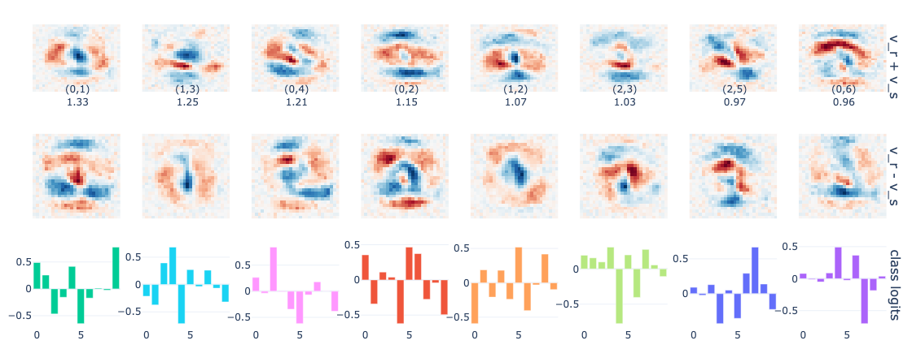

| rank | pair   | strength | top positive class | top positive logit | top negative class | top negative logit |
|------|--------|----------|--------------------|--------------------|--------------------|--------------------|
| 0    | (0, 1) | 1.331173 | 9                  | 0.775321           | 5                  | -0.647127          |
| 1    | (1, 3) | 1.252356 | 3                  | 0.683631           | 4                  | -0.714706          |
| 2    | (0, 4) | 1.213427 | 2                  | 0.844918           | 5                  | -0.620480          |
| 3    | (0, 2) | 1.150527 | 5                  | 0.465916           | 4                  | -0.621942          |
| 4    | (1, 2) | 1.068348 | 5                  | 0.518983           | 0                  | -0.594614          |
| 5    | (2, 3) | 1.030288 | 3                  | 0.308397           | 4                  | -0.775942          |
| 6    | (2, 5) | 0.971323 | 7                  | 0.667897           | 3                  | -0.431757          |
| 7    | (0, 6) | 0.961839 | 4                  | 0.492489           | 7                  | -0.703346          |
| 8    | (0, 7) | 0.872027 | 4                  | 0.443889           | 5                  | -0.512118          |
| 9    | (1, 9) | 0.870018 | 6                  | 0.367808           | 2                  | -0.357083          |
| 10   | (1, 4) | 0.846185 | 2                  | 0.479689           | 5                  | -0.494207          |
| 11   | (2, 4) | 0.841394 | 4                  | 0.308530           | 6                  | -0.411685          |

### Observations:
- These are the visualizations of top-k-feature interactions showing pixel-level maps of activity --- and of course similar to the previous section, these are not heatmaps, instead showing which combinations of regions produce the highest attributions for a given digit --- and even of course, we look at positive contribution for the upper-rows and negative for later rows.
- Intuitively, these are visibly scattered features and still not very interpretable.

## Step-6:

- Now, we move back to the per-class setting to make things more interpretable, we decompose each core $M_c$ into sum of rank-1 outer products --- where we leverage sparse learning.

$$M_c \;\approx\; \sum_{k=1}^{K} A_{c,k}\, u_k u_k^\top, \qquad U \in \mathbb{R}^{R \times K}, \quad A \in \mathbb{R}^{C \times K},$$

with each atom lifted to pixel space as $\phi_k = V u_k \in \mathbb{R}^P$, so the class logit reads $\operatorname{logit}_c(x) = \sum_k A_{c,k}\,(\phi_k^\top x)^2$.

- So, now we train each of these decompositions of $M_c$ jointly to produce interpretable "atoms", under the loss

$$\mathcal{L} \;=\; \big\|\hat{M} - M_{\text{target}}\big\|^{\,2} \;+\; \lambda\,\|A\|_1, \qquad \lambda = 10^{-3}, \quad K = 64,$$

with $u_k$ column-normalised every step to remove scale degeneracy.
- And, then we first plot the same visualization as before

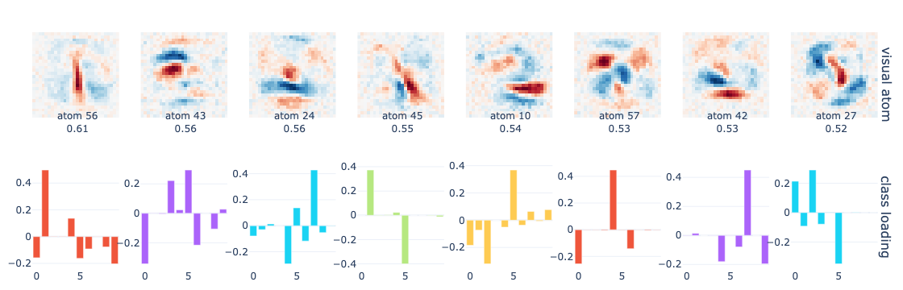

### Observations:
- The way to interpret these graphs is a bit different --- here each pixel-space atom $\phi_k = V u_k$ is its own template (not a $v_r + v_s$ vs $v_r - v_s$ pair), so the row is *not* showing a complementary positive-vs-negative half. Each atom contributes $A_{c,k}\,(\phi_k^\top x)^2$ to class $c$'s logit on its own, and the red/blue colouring within one atom is the signed contrast pattern that gets dot-producted with $x$ before being squared. Because of the squaring, flipping the entire sign of $\phi_k$ (red ↔ blue swap) leaves the contribution unchanged --- so the absolute polarity of red vs blue *within an atom* is gauge, only the relative arrangement matters. The bar chart $A_{:,k}$ underneath is what carries true sign: a positive bar adds to that class' logit, a negative bar subtracts.
- Intuitively:
    - It clearly shows how '1' is encoded in most important feature --- as a very distinct feature.
    - how '5' is encoded is also discernible in the 'atom 10' here, especially in how '2' is downweighted by the activation regions.

## Extra -- box-plots of sparse vs. tucker decomposition

To check whether the sparse atoms are *actually* more interpretable than the dense Tucker pair components --- and not just visually different --- we compare both populations on four sparsity / selectivity metrics. For a vector $v$ (either a pixel-space pattern $\phi_k$ or a class-loading vector $A_{:,k}$):

$$\text{top-10\% energy}(v) \;=\; \frac{\sum_{i \in \text{top 10\%}} v_i^{\,2}}{\sum_i v_i^{\,2}}, \qquad \text{effective support}(v) \;=\; \frac{1}{n}\cdot\frac{\big(\sum_i |v_i|\big)^2}{\sum_i v_i^{\,2}}.$$

The first is *higher* when energy concentrates in a few dimensions; the second is the participation ratio, *lower* when fewer dimensions are active. We compute both on the visual side ($\phi_k$, $n = 784$) and the class side (loading vector, $n = 10$).

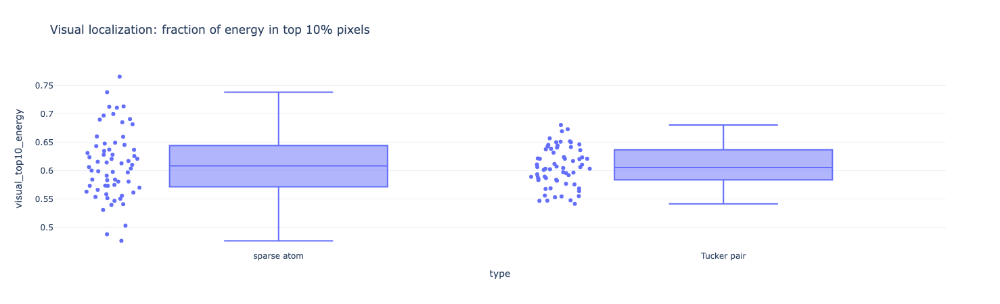
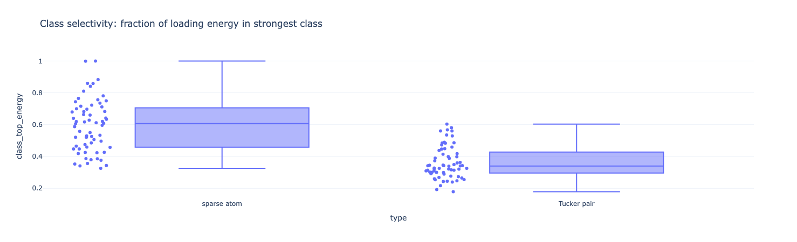
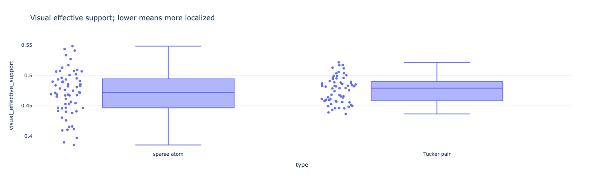
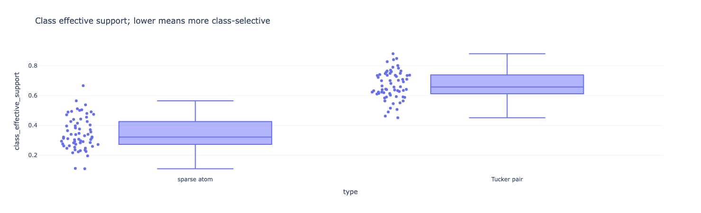

### Observations:
- **Visual localization (top-10% energy):** the sparse atoms concentrate more energy in the top 10% pixels than the Tucker pair patterns do --- meaning a sparse atom looks like a *region of the image*, while a Tucker pair pattern $v_r \pm v_s$ tends to spread weight across multiple disjoint regions because it's a sum/difference of two whole-image basis directions.
- **Class selectivity (top-class energy):** sparse atoms also concentrate more loading on a single class than the Tucker pair components do --- consistent with the fact that the L1 penalty in Step 6 was applied to $A$, explicitly encouraging this.
- **Effective support (visual + class):** both visual and class effective support are lower for sparse atoms, confirming the localization story from a different angle --- this isn't an artifact of one outlier metric.
- Combining all four: the Tucker pair components are *interactions* by construction (each one mixes two basis directions and contributes to many classes via $2 M_{:,r,s}$), while the sparse atoms are by construction closer to "this visual feature is associated with this digit." That's the qualitative gap visible in the Step-5 vs Step-6 figures, made quantitative.
- One caveat: the sparse decomposition reaches mean completeness ≈ 0.98 vs. dense Tucker ≈ 0.9823 at the same $R$, so we are *not* paying any reconstruction cost for this interpretability gain --- the sparse parameterization simply re-expresses the same off-diagonal mass as a sum of rank-1 atomic features instead of a dense $R \times R$ core.